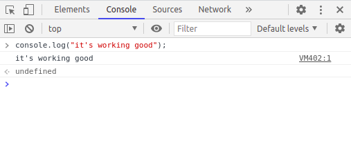

# How To Run JS files.

In this article I'm talking about the ways you can execute a js file.
## There are 3 main ways.

### 1. ```<script>``` Tag
using script tag we can run js in an html file the browser js engine will take this section and execute by its own. When a browser encounter ```<script>``` tag browser immediately stop the parsing of html and wait for fetching and executing the code this is because the javascript will some times add or manipulate DOM elements in order to display that manipulation/insert browser need to block the parsing and proceeds after the code is executed. So traditionally developers will put the ```<script>``` after the body because the browser can execute it after the html is fully parsed.
```HTML
<head>
...
</head>
<body>
...
<script>
console.log("hi");
</script>
</body>
```
But the HTML5 introduce 2 attribute that help us to define when we want to execute our code.
#### 1. [defer](https://www.w3schools.com/tags/att_script_defer.asp)
it is used to tell the browser only execute the code when the browser is fully parsed and you can put in any section of html and it will not block html parsing.
```HTML
<head>
<script defer>
console.log("hi");
</script>
...
</head>
<body>
...
</body>
```
#### 2. [async](https://www.w3schools.com/tags/att_script_async.asp)
This attribute help our code to execute asynchronously. That mean the ```<script>``` that put a async attribute will execute along side with the parsing of html without blocking it. This will very helpful when we need to run a pre script in order to run our main script.
```HTML
<head>
<script async>
console.log("hi");
</script>
...
</head>
<body>
...
</body>
```

### 2. Linking external files.
This is the go to method when writing med to large application. This method allow the developers to isolate javascript and html.
The attributes that discussed above is also applicable to this.
```HTML
<head>
<script src="demo_defer.js" async></script>
...
</head>
<body>
...
</body>
```

### 3. Console
Every JS engine has a way to execute script like a shell script. This helps to debug  and understand the inner working or outputs.
The [V8 engine](https://v8.dev/) even has a shell script to do this called [d8](https://v8.dev/docs/d8).<br />
.